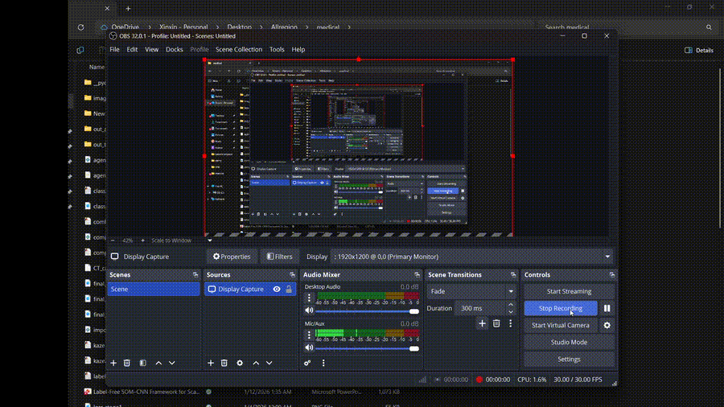

# Label-Free CT-Style Lesion / Defect Segmentation with SOM–CNN

Label-free, pixel/voxel-level segmentation of CT-style lesions and defects on
**AutoPET III (FDG-PET/CT) CT volumes** using a physics-aware Self-Organizing
Map (SOM) teacher and a lightweight CNN/U-Net student.

This demo shows how a SOM can provide full-resolution “teacher” masks in
**seconds on CPU**, and how a small U-Net student can match these masks with
high overlap (**IoU ≈ 0.98, Dice ≈ 0.99 vs SOM-derived teacher masks**) without any manual
voxel-wise labels.

**Note:** Some figures are displayed on a cropped slice canvas for visualization; interpretation should follow the overlay on the CT base image.

See the full slide deck in  
[medical_ct_som_cnn_demo.pdf](docs/medical_ct_som_cnn_demo.pdf)

## Problem

Medical and industrial CT segmentation usually relies on expert-drawn voxel
labels, which are:

- expensive,
- slow to obtain,
- difficult to standardize across annotators.

**Goal:** obtain 3D lesion/defect masks with **zero manual voxel labels**,  
while keeping the model **interpretable** and **easy to reproduce on a laptop**.

## Data

- 3D CT-style volumes (slices) with visible lesions or defects.
- In this demo, we use **CT slices from the AutoPET III FDG-PET/CT dataset**
  (CT channel only).
- Only raw images are used during training; no ground-truth voxel masks are
  assumed.
- Evaluation is done by comparing the CNN/U-Net student to SOM teacher masks
  at slice level (IoU / Dice vs teacher).

## Method: SOM teacher → CNN/U-Net student

### Physics / appearance-aware features

For each pixel/voxel in a CT slice, we compute a small set of
physics/appearance-aware descriptors, e.g.:

- intensity (optionally log-transformed),
- local contrast and edge sharpness,
- neighborhood texture / “thinness”,
- simple statistics over a small spatial window.

These form a low-dimensional descriptor vector for each location, designed
to separate lesion from background in a **physics-consistent** way.

### PCA + SOM clustering

- PCA reduces feature dimension while preserving lesion vs background variance.
- A Self-Organizing Map (SOM) is trained on a subset of slices to cluster
  pixels into a small number of classes (e.g. background, soft tissue,
  lesion/defect).
- SOM centroids (weight vectors) define a reusable **codebook** for the given
  imaging physics.

### SOM “teacher” masks

- The trained SOM is applied to full-resolution slices (arbitrary size) in
  **seconds on CPU**.
- Clusters are interpreted (via feature profiles and spatial distribution) and
  grouped into a binary lesion/defect vs non-defect mask.
- This yields a **zero-cost pixel-level teacher**.

### CNN/U-Net “student”

A lightweight U-Net is then trained on CT slices using the SOM masks as
supervision (teacher–student setup). The student learns a smooth voxel-level
segmentation that matches the SOM teacher, with:

- IoU ≈ 0.99  
- Dice ≈ 0.98  

on held-out slices, while requiring **zero manual voxel labels**.

Training time in this demo:

- **Training:** ~5 minutes on a single GPU  
- **Inference:** real-time / near real-time per slice on GPU

## Geometry-Consistent Registration & Spatiotemporal Tracking

To support **longitudinal / spatiotemporal analysis**, we optionally add a
geometry-consistent registration module:

- KAZE-based keypoint detection and matching between time points or
  acquisitions,
- RANSAC-based robust estimation of geometric transform,
- slice-to-slice / volume-to-volume alignment so that changes in masks
  mainly reflect **true lesion evolution**, not misregistration.

This KAZE + RANSAC registration is suitable for **lesion evolution tracking**
across time, protocols, or slightly different acquisition geometries.

## Key Properties

- **Label-free teacher:** SOM provides full-resolution masks without any
  expert voxel annotations.
- **Pixel/voxel-level:** both SOM and U-Net operate on full slices/volumes,
  not cropped patches.
- **Spatiotemporal-ready:** optional KAZE + RANSAC registration supports
  longitudinal lesion evolution tracking.
- **Transferable:** SOM centroids/codebooks learned on some slices can be
  reused on other slices/volumes with the same imaging physics.
- **Laptop-friendly:** SOM teacher runs in seconds on CPU; the U-Net student
  trains in a few minutes on a single-GPU laptop.

## Results (see PDF)

Highlights from '[medical_ct_som_cnn_demo.pdf](docs/medical_ct_som_cnn_demo.pdf)'

- SOM clustering produces clean lesion/defect masks with clear separation
  from background.
- U-Net students trained purely on SOM labels achieve IoU ≈ 0.98 and
  Dice ≈ 0.99 versus the SOM teacher on held-out slices.
- The pipeline scales to whole volumes (all slices), producing full-volume
  masks without manual voxel labeling.
- Geometry-consistent registration (KAZE + RANSAC) enables longitudinal
  visualization and tracking of lesion evolution.

## 🔬 CT Demo: SOM → Pseudo-label → Segmentation

